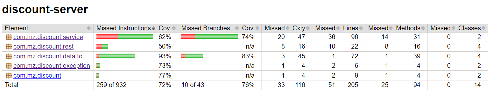

<h1 align="center"> Discount (server) </h1>  

## Table of Contents

- [About](#about)
- [Code quality](#code-quality)
- [Requirements](#requirements)
- [Configuration](#configuration)
- [How to start](#how-to-start)
- [Features](#features)

## About

Discount-server is an application to handle products and discounts and their assignments.
One product has only one discount assignment at a time but a discount can be used in many product assignments.
There is a calculator which tells you the value of your products (reduced with discounts).

## Code Quality

I always pay attention to the code quality. There is a minimum unit test coverage set in the [pom.xml](pom.xml) file.
A report is created during the build under **target/site/index.html**

Code coverage on 2022-12-08:

## Requirements

## Configuration

You have to setup the database connection on your local filesystem.
1. In [pom.xml](pom.xml) search the **flyway-maven-plugin** and change the URL
   `<url>jdbc:h2:file:C:/DEV/testdb</url>`
    pointing to your file system.
2. In [application.properties](src/main/resources/application.properties) file change
   `spring.datasource.url=jdbc:h2:file:C:/DEV/testdb` entry either.

Then create a build.
- `mvn clean install`
- `mvn flyway:migrate`

## How to start

To start the application type `mvn spring-boot:run`

To check the H2 console, open http://localhost:8080/h2-console/  
You can reach Swagger2 UI on http://localhost:8080/swagger-ui/

## Features

- Java 8
- Spring boot application
- Maven build
- Nice README.md documentation
- ORM features
  - Hibernate + JPA
  - H2 file database with console
  - Using in-memory DB for unit tests
  - Flyway integration for creating database and test data
  - ManyToOne unidirectional relationship
- REST features
  - Postman collection (in [postman](postman) folder)
  - custom HTTP 404 page
  - Unified EntityNotFoundException and Advice for handling exceptions
  - WebMvcTest to test the web layer
  - Swagger 2 UI
- Code quality
  - Jacoco report to check minimal code coverage

